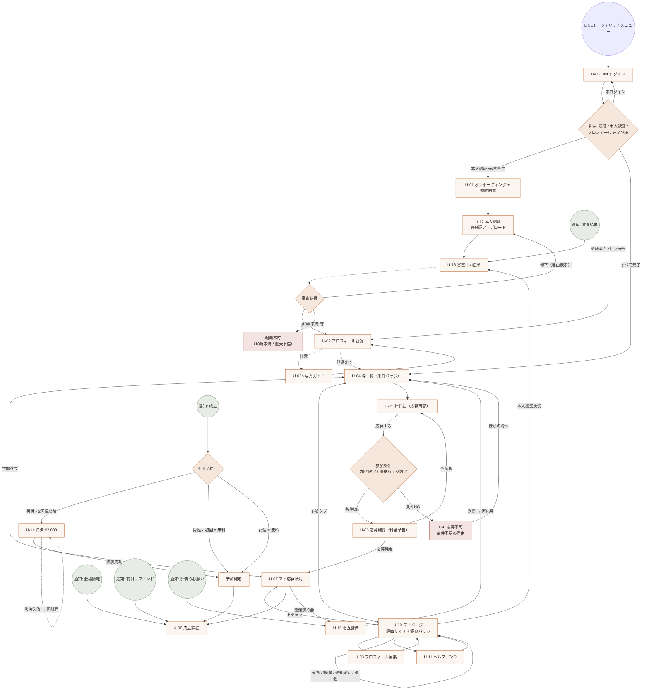
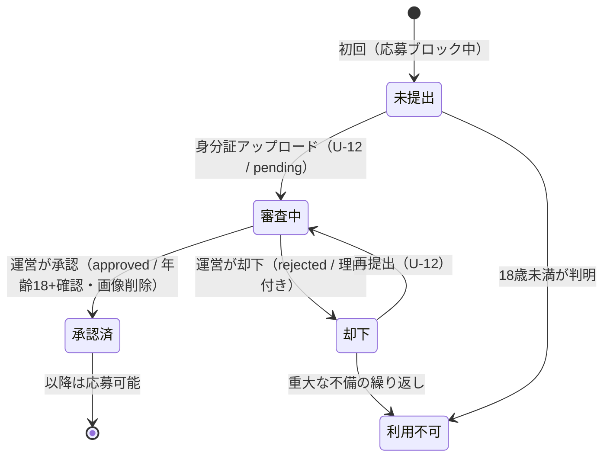
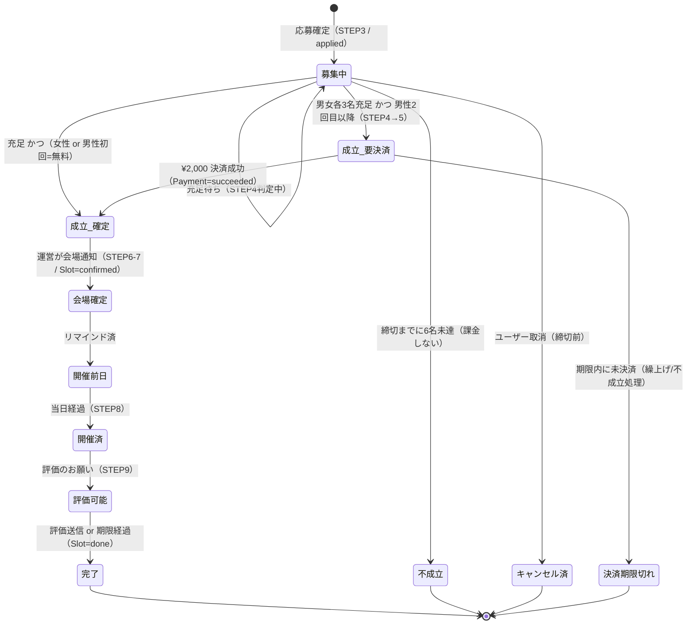
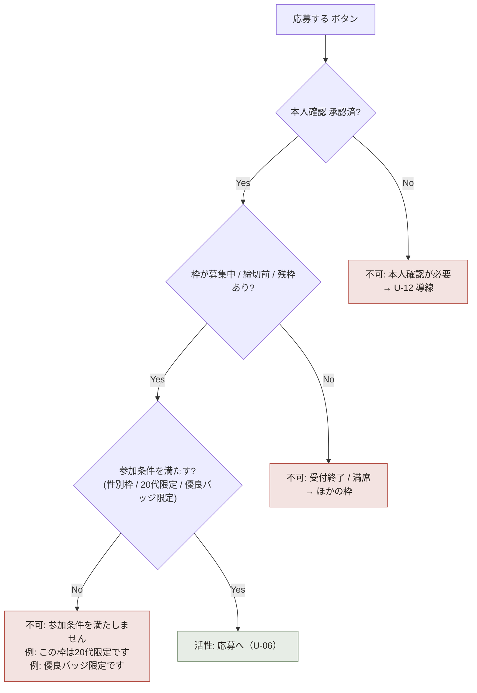
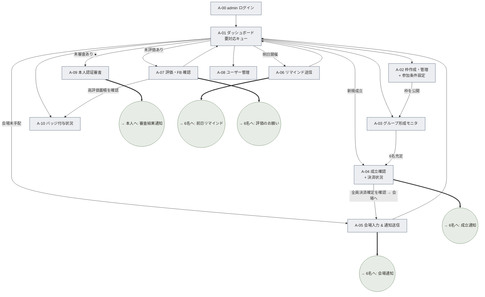
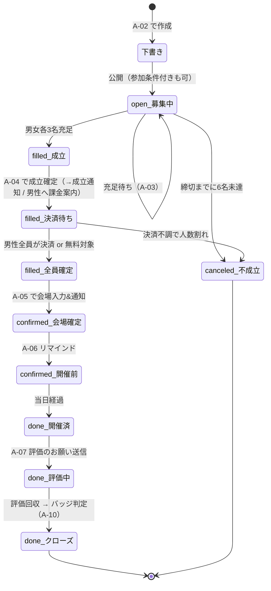
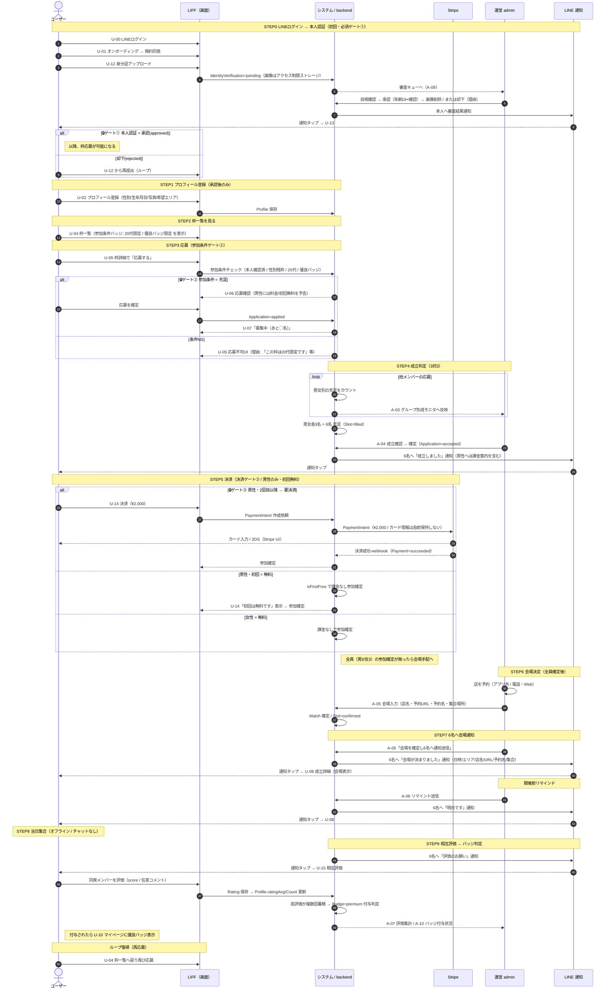

# 画面遷移図 — matching-app（合コン型グループマッチング on LINE / LIFF）

最終更新: 2026-05-30（殿の追加指示反映: 本人認証必須 / Stripe決済 / 評価・バッジ・限定イベント）/ 作成: design-worker
正典: [`../00_master_plan.md`](../00_master_plan.md)（最終更新 2026-05-30）

本書は **ユーザー側（LIFF）** と **運営admin側** の全画面と遷移を定義する。
master_plan「3. コアループ（0〜9 の10ステップ）」を、画面遷移として最後まで辿れることを保証する。

前提（master_plan より）:
- LINE 上で完結（LIFF）。**スマホ縦** が主。デスクトップ考慮不要（adminのみPC）。
- 男女 3対3 = 6人。東京（恵比寿 / 池袋 / 銀座）。**アプリ内チャット無し**。会場は運営が手動手配して6人へ通知。
- **本人認証＝必須**（公的身分証アップロード→運営目視→承認。年齢確認18+を兼ねる）。**未認証は枠応募不可**。
- **決済 Stripe**: 男性=1回¥2,000（**初回参加は無料**）/ **女性は常に無料**。不成立時は課金しない。
- **評価**: イベント後に相互評価 → 高評価蓄積で**優良バッジ**付与。
- **限定イベント**: 枠に参加条件（**20代限定** / **優良バッジ限定**）を設定可能。条件不足は応募不可UI。

---

## 0. 凡例

```
[ 画面 ]            … ユーザーが操作する画面（LIFF 内ページ）
(( 通知 ))          … LINE プッシュ通知（画面ではなく到達点。タップで LIFF を開く）
{ admin 画面 }      … 運営 admin の画面（PC 想定だが本書ではフロー定義のみ）
< システム処理 >    … 自動処理（人手を介さない判定・集計・課金）
🔒 ゲート           … 通過条件（本人認証 / 参加条件 / 決済）。未充足は先へ進めない
──▶                遷移（ユーザー操作 or 通知タップ）
═▶                 状態の自動遷移（システム / 運営アクション起点）
```

呼称: 「応募 = エントリー」、6人成立 = 「マッチング成立」、開催 1 件 = 「枠（スロット / Slot）」、開催実績 = 「イベント」。
（master_plan データモデル User / Profile / IdentityVerification / Slot / Application / Match / Payment / Rating / Badge と対応）

本サービスには **3つの主要ゲート** がある。画面設計の背骨:
1. **本人認証ゲート**（未認証は枠応募不可 / コアループ STEP0）
2. **参加条件ゲート**（20代限定・優良バッジ限定の枠は条件不足だと応募不可 / STEP3）
3. **決済ゲート**（男性は成立後 ¥2,000 決済で参加確定。初回無料 / 女性は無料スキップ / STEP5）

---

## 1. 全体マップ（コアループ 0〜9 の10ステップ対応）

```mermaid
flowchart TD
    %% ===== 立ち上げ〜本人認証（STEP0）=====
    LOGIN["[ U-00 LINEログイン ]"]
    ONB["[ U-01 オンボーディング + 規約同意 ]"]
    KYC["[ U-12 本人認証\n身分証アップロード ]🔒"]
    KYCWAIT["[ U-13 審査中 ]"]
    KYCRES{"審査結果\n（運営目視）"}
    PROF["[ U-02 プロフィール登録 ]"]

    LOGIN -->|"STEP0 LINEログイン"| ONB
    ONB --> KYC
    KYC -->|"STEP0 身分証提出"| KYCWAIT
    KYCWAIT -.-> KYCRES
    KYCRES -->|"承認（年齢18+確認済）"| PROF
    KYCRES -->|"却下 → 再提出"| KYC

    %% ===== プロフィール〜枠（STEP1-2）=====
    SLOTS["[ U-04 枠一覧\n条件バッジ表示 ]"]
    SLOTD["[ U-05 枠詳細\n参加条件 / 応募可否 ]🔒"]
    PROF -->|"STEP1 プロフィール登録"| SLOTS
    SLOTS -->|"STEP2 枠一覧を見る"| SLOTD

    %% ===== 応募（STEP3 / 参加条件ゲート）=====
    COND{"参加条件チェック\n20代限定 / 優良バッジ限定"}
    APPLY["[ U-06 応募確認 ]"]
    BLOCKED["[ 応募不可 表示\n条件不足の理由提示 ]"]
    SLOTD -->|"応募する"| COND
    COND -->|"条件OK"| APPLY
    COND -->|"条件NG"| BLOCKED
    APPLY -->|"STEP3 応募"| MYAPP["[ U-07 マイ応募状況 ]"]

    %% ===== 成立（STEP4）=====
    FORM{{"< STEP4 成立判定 >\n男女各3名が揃うか"}}
    APPLY -.エントリー登録.-> FORM
    MATCH(("STEP4 成立 → 6名へ通知"))
    FORM ==>|"6名充足"| MATCH

    %% ===== 決済ゲート（STEP5 / 男性のみ）=====
    PAYGATE{"性別 / 初回判定"}
    PAY["[ U-14 決済\n¥2,000 Stripe ]🔒"]
    PAYDONE["参加確定"]
    MATCH --> PAYGATE
    PAYGATE -->|"男性・2回目以降"| PAY
    PAYGATE -->|"男性・初回 = 無料"| PAYDONE
    PAYGATE -->|"女性 = 無料"| PAYDONE
    PAY -->|"STEP5 決済成功"| PAYDONE

    %% ===== 会場手配〜通知（STEP6-7）=====
    ADMINVENUE["{ A-05 会場入力 & 通知送信 }"]
    PAYDONE -. 全員確定 .-> ADMINVENUE
    VENUENOTI(("STEP7 会場情報を6名へ通知"))
    ADMINVENUE ==>|"STEP6 会場確定→送信"| VENUENOTI
    DETAIL["[ U-08 成立詳細\n会場 / 予約名 / メンバー ]"]
    PAYDONE --> DETAIL
    VENUENOTI --> DETAIL

    %% ===== 当日（STEP8）=====
    EVENT["STEP8 当日集合（オフライン / チャットなし）"]
    DETAIL --> EVENT

    %% ===== 相互評価 → バッジ（STEP9）=====
    RATENOTI(("STEP9 評価のお願い 通知"))
    EVENT ==> RATENOTI
    RATE["[ U-15 相互評価 ]"]
    RATENOTI --> RATE
    BADGEJUDGE{{"< バッジ判定 >\n高評価が複数回蓄積"}}
    RATE ==> BADGEJUDGE
    MYPAGE["[ U-10 マイページ\n評価サマリ + 優良バッジ ]"]
    BADGEJUDGE -. 付与 .-> MYPAGE
    RATE -->|"完了 → 再応募"| SLOTS

    classDef user fill:#FBF7F0,stroke:#C2703D,color:#2B2622;
    classDef sys fill:#EFEAE2,stroke:#8A8175,color:#2B2622;
    classDef noti fill:#E7EDE6,stroke:#5E7A57,color:#2B2622;
    classDef admin fill:#ECEEF2,stroke:#3F5168,color:#2B2622;
    classDef gate fill:#F6E7DC,stroke:#C2703D,color:#2B2622;
    classDef block fill:#F3E3E1,stroke:#B0463C,color:#2B2622;
    class LOGIN,ONB,KYC,KYCWAIT,PROF,SLOTS,SLOTD,APPLY,MYAPP,PAY,DETAIL,RATE,MYPAGE user;
    class FORM,BADGEJUDGE,EVENT,PAYDONE sys;
    class MATCH,VENUENOTI,RATENOTI noti;
    class ADMINVENUE admin;
    class KYCRES,COND,PAYGATE gate;
    class BLOCKED block;
```



### コアループ 0〜9 → 画面 / 到達点 対応表

master_plan §3 の番号に厳密対応。

| STEP | master_plan の定義 | 主担当 | 画面 / 到達点 |
|------|-------------------|--------|---------------|
| 0 | LINEログイン → **本人認証**（身分証）＋年齢確認（初回のみ） | ユーザー / admin審査 | `[U-00]→[U-01]→[U-12 身分証提出]→[U-13 審査中]→(承認/却下)` ＋ `{A-09 本人認証審査}` |
| 1 | プロフィール登録（性別/生年月日/写真/希望エリア） | ユーザー | `[U-02 プロフィール登録]` |
| 2 | 枠一覧を見る（条件付き枠あり: 20代限定 / 優良バッジ限定） | ユーザー | `[U-04 枠一覧（条件バッジ表示）]` |
| 3 | 応募（**条件を満たす場合のみ**） | ユーザー | `[U-05 枠詳細（応募可否）]→[U-06 応募確認]→[U-07]` / 条件不足は応募不可UI |
| 4 | 3対3が揃う＝成立 | システム / admin | `< 成立判定 >` ＋ `{A-03}/{A-04}` → `((成立通知))` |
| 5 | **男性は ¥2,000 決済（初回無料）/ 女性は無料** | ユーザー / システム | `[U-14 決済]`（男性2回目以降）/ 女性・初回は自動スキップ → 参加確定 |
| 6 | 運営が会場を決定（店名/予約URL/予約名） | admin | `{A-05 会場入力 & 通知送信}` |
| 7 | 6人へLINE通知（日時/エリア/店名/URL/予約名/集合） | admin / システム | `((会場通知))→[U-08 成立詳細]` |
| 8 | 当日集合（チャットなし） | ユーザー（オフライン） | 会場で会う（アプリ外）。前にリマインド通知 |
| 9 | イベント後、相互評価 → **バッジ判定** | ユーザー / システム | `((評価のお願い))→[U-15 相互評価]→< バッジ判定 >→[U-10 マイページ]` |

ループ復帰: 評価完了 → 再び `[U-04 枠一覧]`。

---

## 2. ユーザー側 画面遷移（詳細）

### 2.1 全画面リスト（ユーザー）

新規画面（今回追加）: **U-12 本人認証 / U-13 審査中（承認・却下含む）/ U-14 決済 / U-15 相互評価**。

| ID | 画面名 | 役割 | 主な入口 |
|----|--------|------|----------|
| U-00 | スプラッシュ / LINEログイン | LIFF 起動・LINE 認証（STEP0） | LINE トーク / リッチメニュー |
| U-01 | オンボーディング | サービス説明（3対3 / チャット無し / 本人認証あり）・規約同意 | 初回ログイン後 |
| **U-12** | **本人認証（身分証アップロード）** | 公的身分証の種別選択・撮影/選択・送信（STEP0・必須ゲート） | オンボ後 / 応募ブロック時 |
| **U-13** | **本人認証 審査中 / 結果** | 審査中の待機表示・**承認**・**却下（理由 + 再提出）** | 提出後 / 通知 |
| U-02 | プロフィール登録 | 写真 / 表示名 / 性別 / 生年月日 / 希望エリア / 一言（STEP1） | 承認後 |
| U-02b | 写真ガイド | 良い写真の撮り方ガイド（任意） | U-02 から |
| U-03 | プロフィール編集 | 既存プロフィールの修正 | マイページ |
| U-04 | 枠一覧 | 開催枠を一覧（エリア×日時帯）。**参加条件バッジ表示**（STEP2） | ホーム / 下部ナビ |
| U-05 | 枠詳細 | 1枠の詳細・充足・**参加条件と自分の可否**・応募/応募不可（STEP3） | 枠一覧から |
| U-06 | 応募確認 | プロフィール確認 → 応募確定。**男性は料金/初回無料を予告**（STEP3） | 枠詳細から |
| U-07 | マイ応募状況 | 応募の状態（募集中 / 成立・要決済 / 確定 / 終了）一覧 | 下部ナビ |
| **U-14** | **決済（¥2,000 Stripe）** | 男性の成立後決済。**初回無料の明示**。Stripe Checkout/Elements 導線（STEP5） | 成立通知（男性・2回目以降）/ マイ応募状況 |
| U-08 | 成立詳細 | 会場・日時・予約名・メンバー概要・注意（STEP7/8 の案内所） | 成立通知 / マイ応募状況 |
| **U-15** | **相互評価** | イベント後、同席メンバーを相互評価（STEP9） | 評価のお願い通知 / マイ応募状況 |
| U-10 | マイページ / 設定 | プロフィール・**評価サマリ + 優良バッジ**・支払い履歴・通知設定・ヘルプ・退会 | 下部ナビ |
| U-11 | ヘルプ / よくある質問 | FAQ（本人認証 / 料金 / 評価 / 条件 等）・問い合わせ | マイページ |
| U-E | 空 / エラー / 受付終了 / 条件不足 / 決済失敗 | 各画面の空・エラー・締切・条件NG・決済リトライ | 各画面内 |

### 2.2 ナビゲーション構造

通常時は **下部タブ 3 つ** で回遊。本人認証は通常タブの外（初回必須フロー / マイページから状態確認）。

```
┌─────────────────────────────────────────────┐
│            （各画面コンテンツ）              │
├──────────────┬──────────────┬───────────────┤
│   枠をさがす   │   応募状況     │   マイページ    │
│   (U-04)      │   (U-07)      │   (U-10)       │
└──────────────┴──────────────┴───────────────┘
```

通知からの深いリンク着地: 成立 → U-08 or U-14（男性・要決済）/ 会場 → U-08 / 審査結果 → U-13 / 評価のお願い → U-15。

### 2.3 遷移図（ユーザー / ゲート明示）

下図はユーザーの全画面遷移。3ゲート（本人認証 / 参加条件 / 決済）と、LINEプッシュ通知からの深いリンク着地、下部タブの往復を示す。



### 2.3b 画面ID 対応表（screen-flow ⇔ wireframes 全画面）

下表で **ユーザー U-00〜U-15・U-E** と **admin A-00〜A-10** の全画面について、本書の定義箇所と [`wireframes.md`](./wireframes.md) のワイヤー有無を対応づける（全画面を網羅）。

ユーザー画面:

| 画面ID | 画面名 | screen-flow 定義 | wireframes ワイヤー | 対応コアループ STEP |
|--------|--------|------------------|---------------------|----------------------|
| U-00 | スプラッシュ / LINEログイン | §2.1 / §1 / §2.3 / §4 | あり（U-00） | STEP0 |
| U-01 | オンボーディング + 規約同意 | §2.1 / §1 / §2.3 / §4 | あり（U-01） | STEP0 |
| U-12 | 本人認証（身分証アップロード） | §2.1 / §1 / §2.3 / §2.4 / §4 | あり（U-12） | STEP0 |
| U-13 | 本人認証 審査中 / 結果（承認・却下） | §2.1 / §1 / §2.3 / §2.4 / §4 | あり（U-13） | STEP0 |
| U-02 | プロフィール登録 | §2.1 / §1 / §2.3 / §4 | あり（U-02） | STEP1 |
| U-02b | 写真ガイド | §2.1 / §2.3 | あり（U-02b） | STEP1 補助 |
| U-03 | プロフィール編集 | §2.1 / §2.3 | あり（U-02 流用 / U-03 記述） | — |
| U-04 | 枠一覧（条件バッジ表示） | §2.1 / §1 / §2.3 / §2.6 / §4 | あり（U-04） | STEP2 |
| U-05 | 枠詳細（参加条件 / 応募可否） | §2.1 / §1 / §2.3 / §2.6 / §4 | あり（U-05） | STEP3 |
| U-06 | 応募確認（料金予告） | §2.1 / §1 / §2.3 / §4 | あり（U-06） | STEP3 |
| U-07 | マイ応募状況（要決済状態） | §2.1 / §1 / §2.3 / §2.5 | あり（U-07） | STEP3〜9 横断 |
| U-14 | 決済（¥2,000・初回無料 / Stripe） | §2.1 / §1 / §2.3 / §2.5 / §4 | あり（U-14） | STEP5 |
| U-08 | 成立詳細（会場情報） | §2.1 / §1 / §2.3 / §4 | あり（U-08） | STEP7 / 8 |
| U-15 | 相互評価 | §2.1 / §1 / §2.3 / §4 | あり（U-15） | STEP9 |
| U-10 | マイページ（評価サマリ + 優良バッジ） | §2.1 / §1 / §2.3 / §4 | あり（U-10） | STEP9 後 / 横断 |
| U-11 | ヘルプ / よくある質問 | §2.1 / §2.3 | あり（U-11） | 横断 |
| U-E | 空 / エラー / 条件不足 / 決済失敗 | §2.1 / §2.5 / §2.6 | あり（U-E） | 横断 |

運営 admin 画面:

| 画面ID | 画面名 | screen-flow 定義 | wireframes ワイヤー | 対応コアループ STEP |
|--------|--------|------------------|---------------------|----------------------|
| A-00 | admin ログイン | §3.1 / §3.2 | （ログイン画面 / A-01 への前段。運営スタッフ認証のみの最小画面のためワイヤー化しない） | — |
| A-01 | ダッシュボード（要対応キュー） | §3.1 / §3.2 | あり（A-01） | 全体ハブ |
| A-09 | 本人認証審査（承認 / 却下） | §3.1 / §3.2 / §4 | あり（A-09） | STEP0 |
| A-02 | 枠作成・管理（参加条件設定） | §3.1 / §3.2 / §3.3 | あり（A-02） | STEP2 前提 |
| A-03 | グループ形成モニタ | §3.1 / §3.2 / §3.3 | あり（A-03） | STEP4 判定 |
| A-04 | 成立確認（決済状況） | §3.1 / §3.2 / §4 | あり（A-04） | STEP4 / 5 |
| A-05 | 会場入力 & 通知送信 | §3.1 / §3.2 / §3.3 / §4 | あり（A-05） | STEP6 + 7 |
| A-06 | リマインド送信 | §3.1 / §3.2 / §4 | あり（A-06） | STEP8 前 |
| A-07 | 評価・フィードバック確認 | §3.1 / §3.2 / §4 | あり（A-07） | STEP9 |
| A-10 | バッジ付与状況 | §3.1 / §3.2 / §4 | あり（A-10） | STEP9 後 |
| A-08 | ユーザー管理 | §3.1 / §3.2 | あり（A-08） | 運用補助・安全 |

注: A-00 admin ログインは運営スタッフの認証のみの最小画面のため wireframes ではワイヤーを起こさず、ログイン後 A-01 から記述している（[`wireframes.md`](./wireframes.md) admin 節）。本書 §3 にフローとして定義済み。

### 2.4 本人認証ステータスのモデル（U-12 / U-13 / マイページ）

master_plan データモデル IdentityVerification.status（`pending`|`approved`|`rejected`）に対応。
**未認証・審査中・却下のいずれも枠応募はブロック**（§2.6 参照）。



状態 → ユーザー向け文言:
- 未提出: 「ご利用には本人確認が必要です」＋提出導線
- 審査中: 「確認中です（通常1〜2営業日）。完了したらお知らせします」
- 承認済: バッジ「本人確認済」（マイページに静かに表示）
- 却下: 「確認できませんでした：{理由}」＋再提出導線

### 2.5 応募 → 成立 → 決済 → 開催ステータス（マイ応募状況 / 成立詳細）

決済ゲートを含むユーザー視点の状態。Application.status / Slot.status / Payment.status / Match と整合。



状態 → ユーザー向け文言（抜粋）:
- 成立_要決済（男性）: 「成立しました。参加には ¥2,000 のお支払いが必要です（{期限}まで）」
- 成立_確定（男性初回）: 「成立しました。初回は無料です」
- 成立_確定（女性）: 「成立しました（参加無料）」
- 決済期限切れ: 「お支払い期限が過ぎたため、今回は参加見送りとなりました」

### 2.6 応募ゲーティング ロジック（U-05 の応募ボタン状態）

枠詳細の「応募する」ボタンは、次の AND 条件をすべて満たすときのみ活性。1つでも欠けると **応募不可UI** + 理由提示。



---

## 3. 運営 admin 側 画面遷移（詳細）

新規画面（今回追加）: **A-09 本人認証審査（承認/却下）**、A-02 に **枠条件設定（20代限定/優良バッジ限定）** を統合、**A-10 バッジ付与状況**。

### 3.1 全画面リスト（admin）

| ID | 画面名 | 役割 | コアループ対応 |
|----|--------|------|----------------|
| A-00 | admin ログイン | 運営スタッフ認証（User.role=admin） | — |
| A-01 | ダッシュボード | 要対応キュー（**未審査**・成立・**決済待ち**・会場未手配・前日・**未評価**） | 全体ハブ |
| **A-09** | **本人認証審査** | 提出された身分証を目視し **承認 / 却下（理由）**。承認後に画像削除を明示 | STEP0 |
| A-02 | 枠作成・管理 | 枠（日時×エリア）作成 + **参加条件設定（年齢下限/上限・優良バッジ必須）** | STEP2 の前提 |
| A-03 | グループ形成モニタ | 各枠の男女別充足状況を可視化 | STEP4 判定 |
| A-04 | 成立確認 | 6名充足の確認・メンバー詳細・成立確定 → 成立通知。**男性の決済状況**も表示 | STEP4 / 5 |
| A-05 | 会場入力 & 通知送信 | 店名/予約URL/予約名/集合を入力し6名へ通知（**全員の参加確定後**が原則） | STEP6 + STEP7 |
| A-06 | リマインド送信 | 開催前日のリマインド一括送信 | STEP8 前 |
| A-07 | 評価・フィードバック確認 | 相互評価の回収状況・集計（**バッジ判定の根拠**） | STEP9 |
| **A-10** | **バッジ付与状況** | 優良バッジの付与一覧・判定基準・手動付与/取消 | STEP9 後 |
| A-08 | ユーザー管理 | ユーザー確認・本人確認状況・参加履歴・通報対応・利用停止 | 運用補助・安全 |

### 3.2 遷移図（admin）



### 3.3 admin から見た枠（Slot）の状態遷移（決済反映）

master_plan Slot.status（`open`|`filled`|`confirmed`|`done`|`canceled`）に対応。
成立（filled）後、**男性の決済が揃って初めて会場手配（confirmed）へ進む**点が今回の追加。



---

## 4. ユーザー × admin × 通知 の連携シーケンス（全コアループ 0〜9 通し）

本人認証・参加条件・決済・評価を含む受け渡しを1本で。frontend / backend / security の責務境界の根拠。
**3ゲート（本人認証承認済 / 参加条件充足 / 男性決済完了）が図中で判別できる**こと（`alt` 分岐 + Note で明示）。
左の自動採番は手順番号。各 `Note over` がコアループの STEP に対応する。



---

## 5. 網羅チェック

- [x] コアループ **0〜9 の10ステップ**すべてを画面 / 通知 / admin / ゲートで辿れる（§1 対応表・§4 シーケンス）。
- [x] **本人認証フロー**（提出→審査中→承認/却下→再提出、未認証は応募不可）を U-12 / U-13 / §2.4 / §2.6 / A-09 / §4 ゲート① に定義。
- [x] **決済フロー**（男性 ¥2,000・**初回無料明示**・女性無料・不成立は非課金）を U-14 / §2.5 / 決済ゲート / §4 ゲート③ Stripeシーケンスに定義。
- [x] **相互評価 → 優良バッジ** を U-15 / バッジ判定 / A-07 / A-10 / マイページ / §4 STEP9 に定義。
- [x] **限定イベント**（20代限定 / 優良バッジ限定）の条件表示と応募ゲーティングを U-04 / U-05 / §2.6 / A-02 / §4 ゲート② に定義。
- [x] **画面ID対応表**（§2.3b）でユーザー U-00〜U-15・U-E、admin A-00〜A-10 の全画面を screen-flow ⇔ wireframes で対応づけ（全画面網羅）。
- [x] ユーザー画面 17 種（U-00〜U-15・U-E）、運営 admin 画面 11 種（A-00〜A-10）を定義。
- [x] 「チャット無し」「会場は運営手配」を維持（連絡は LINE 通知 + U-08）。
- [x] スマホ縦・下部タブ 3 つの回遊（§2.2）。

引き継ぎは [`wireframes.md`](./wireframes.md)（各画面のレイアウト）と [`design-system.md`](./design-system.md)（トークン・新コンポーネント規約: バッジ / 条件チップ / 審査ステータス / 決済UI / 星評価）を参照。
