# rendez 画面遷移ボード（レビュー用 / Figma代替）

> **このページの見方**: ① まず下の「画面遷移図」（GitHub上で図として描画されます）で全体の流れと**制限ゲート**を把握 → ② その下の「実画面ギャラリー」で各画面の実物を遷移順に確認 → ③ FBは [SPEC.md](SPEC.md) の各画面チェック欄へ。
> スマホ縦（LIFF）が主。adminはPC。**赤い菱形＝通過制限（ゲート）**です。

---

## 1. 画面遷移図（全体・コアループ0〜9）

```mermaid
flowchart TD
    classDef screen fill:#FBF7F0,stroke:#C2703D,color:#2B2622;
    classDef admin fill:#ECEEF2,stroke:#3F5168,color:#2B2622;
    classDef gate fill:#F6E7DC,stroke:#B0463C,color:#2B2622;
    classDef noti fill:#E7EDE6,stroke:#5E7A57,color:#2B2622;

    U00["U-00 LINEログイン"]:::screen
    U01["U-01 オンボ＋規約同意"]:::screen
    U12["U-12 本人認証 提出<br/>(身分証/承認後削除)"]:::screen
    U13["U-13 審査中/承認/却下"]:::screen
    A09{"A-09 運営審査<br/>承認/却下"}:::admin
    G_ID{"🔒ゲート①<br/>本人認証 承認済?<br/>(18歳以上)"}:::gate
    U02["U-02 プロフィール登録<br/>(性別/生年月日/写真/エリア)"]:::screen
    U04["U-04 枠一覧<br/>(条件バッジ/充足/料金)"]:::screen
    U05["U-05 枠詳細"]:::screen
    G_COND{"🔒ゲート②<br/>参加条件<br/>20代限定/優良バッジ限定/性別空き"}:::gate
    U06["U-06 応募確認<br/>(男性に料金/初回無料予告)"]:::screen
    NG["U-E 応募不可<br/>(理由提示・淡色)"]:::screen
    U07["U-07 マイ応募状況"]:::screen
    FORM{{"成立判定<br/>男3・女3 充足"}}:::admin
    G_PAY{"🔒ゲート③<br/>性別/初回判定"}:::gate
    U14["U-14 決済 ¥2,000<br/>(初回無料/女性無料)"]:::screen
    A04["A-04 成立確認"]:::admin
    A05["A-05 会場入力＆通知送信<br/>(店名/予約URL/予約名/集合)"]:::admin
    NOTI(("📨 6名へLINE通知<br/>会場情報")):::noti
    U08["U-08 成立詳細<br/>(会場/メンバー6名)"]:::screen
    EVENT["当日集合（オフライン・チャット無し）"]:::screen
    DONE["A-05 開催完了"]:::admin
    RNOTI(("📨 評価のお願い")):::noti
    U15["U-15 相互評価<br/>(星1-5/任意/匿名)"]:::screen
    BADGE{{"優良バッジ判定<br/>平均4.0&件数5&参加2回"}}:::admin
    U10["U-10 マイページ<br/>(評価/優良バッジ)"]:::screen

    U00 --> U01 --> U12 --> U13
    U13 -.提出.-> A09
    A09 -->|承認| G_ID
    A09 -->|却下/理由| U12
    G_ID -->|OK| U02
    U02 --> U04 --> U05 --> G_COND
    G_COND -->|条件OK| U06 --> U07
    G_COND -->|条件NG| NG --> U04
    U07 -.エントリー.-> FORM
    FORM ==>|成立| G_PAY
    G_PAY -->|男性・2回目以降| U14 --> A04
    G_PAY -->|男性初回/女性=無料| A04
    A04 --> A05 ==> NOTI --> U08
    U08 --> EVENT --> DONE
    DONE ==> RNOTI --> U15 ==> BADGE
    BADGE -.付与.-> U10
    U15 -->|完了| U04
```

---

## 1.5 未登録プレビュー導線（S8マーケ：見える→制限→登録）

> S8要望1。**未ログインでも枠一覧・枠詳細まで閲覧可**。参加者は匿名サマリ（職種・年代・★多軸評価・優良バッジ）で「すごさ」を見せ、氏名・写真・LINEは伏せる。応募ボタンは「登録して参加」に変わり登録導線（U-00）へ。

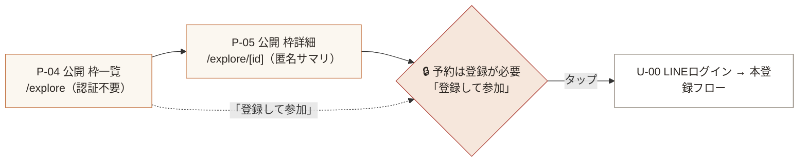

待機モード（S8要望3）: `RELEASE_MODE=waiting` のとき、ログイン必須の本編入口は **C-00「リリースをお待ちください」画面（/coming-soon）** に差し替わる。`/explore`（公開プレビュー）と `/admin/*`（運営）は待機の対象外で常時閲覧可。

---

## 2. 制限（ゲート）早見 — 仕様の肝

| ゲート | 条件 | 通らないと | 該当画面 |
|--------|------|-----------|----------|
| 🔒① 本人認証 | 公的身分証→**AI(Haiku)一次判定→運営承認**（18歳以上確認・AIがOKでも18歳未満は安全弁で却下） | **応募不可**。未認証は U-05 の応募ボタンが無効 | U-12/U-13/A-09 |
| 🔒② 参加条件 | 性別の空き＋（20代限定なら年齢20-29）＋（優良バッジ限定ならバッジ保有） | 応募不可UI（淡色＋理由・赤エラーにしない） | U-04/U-05 |
| 🔒③ 決済 | 男性2回目以降は¥2,000／女性・男性初回は無料／不成立は非課金 | 男性2回目以降は未決済だと参加確定しない | U-14 |
| 🔒④ 予約（プレビュー） | 未登録は閲覧のみ。応募・予約は登録必須 | 「登録して参加」CTAで登録導線へ（S8要望1） | P-04/P-05 |
| ⚠️ ドタキャン罰金 | 無断欠席を同席者**2名以上**が報告→確定→**¥5,000 自動課金**（1名・自己申告では課金しない） | 評価画面の「来なかった」報告で集計（S8要望5） | U-15→課金 |

> すべて**サーバ側で再判定**（クライアント表示を信用しない）。応募の不可理由コード: `identity_required / profile_required / age_out_of_range / badge_required / gender_full / already_applied / slot_closed`
>
> **公開プレビュー（P-04/P-05）のPII方針**: 未認証へ返すのは `PublicSlotDTO`／`PublicMemberDTO` のみ。**氏名・表示名・顔写真・LINE ID・正確な生年月日は含めず**、職種・年代バンド・多軸評価★・優良バッジだけを返す（出口関門 `serializers.ts`）。

---

## 3. 実画面ギャラリー（遷移順・スマホ縦）

> 画像は実際にビルドしたアプリのスクリーンショットです（モックデータ）。

### STEP 0｜ログイン → 本人認証
| U-00 ログイン | U-01 オンボ＋規約 | U-12 本人認証提出 |
|---|---|---|
| 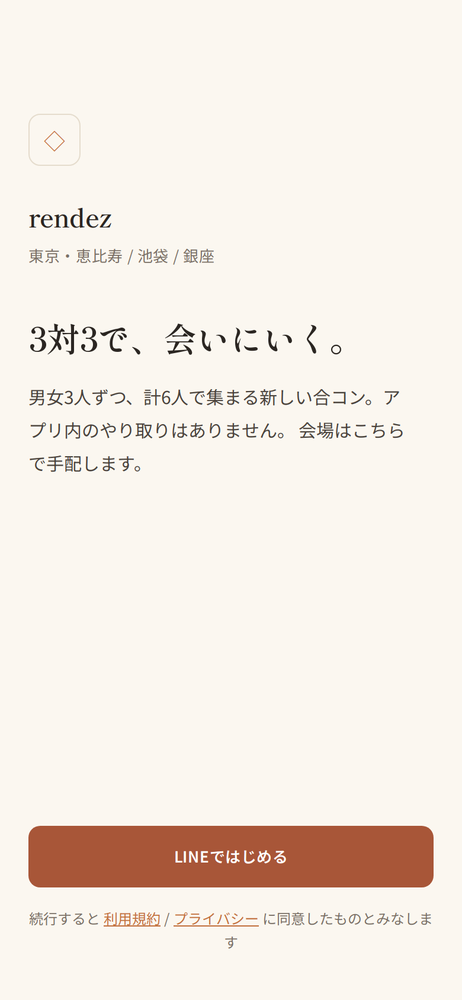 | 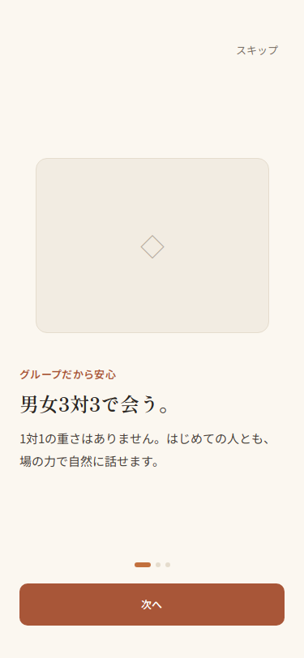 | 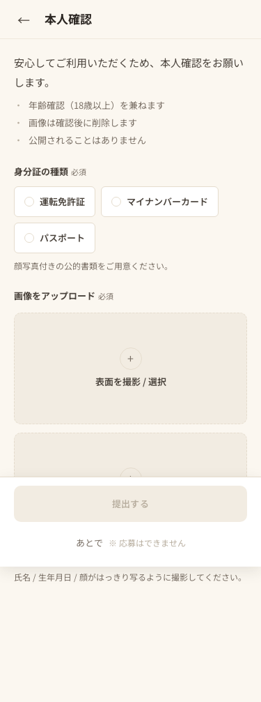 |

| U-13 審査中 | U-13 承認 | U-13 却下（再提出） |
|---|---|---|
| 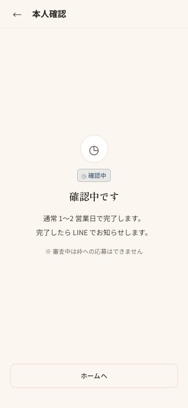 | 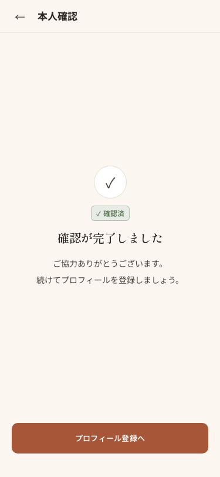 | 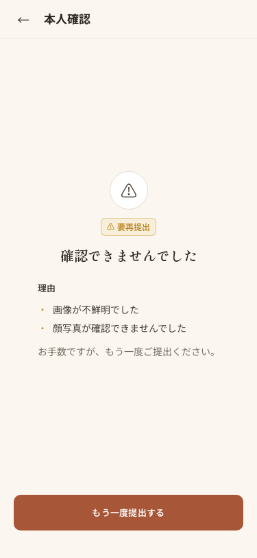 |

### STEP 1-3｜プロフィール → 枠一覧 → 応募
| U-02 プロフィール登録 | U-04 枠一覧（条件/充足/料金） | U-05 枠詳細（応募可） |
|---|---|---|
| 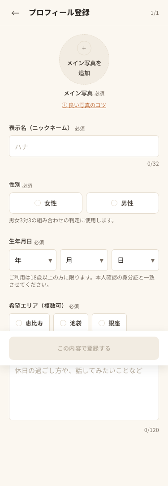 | 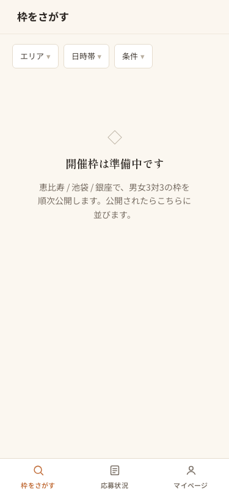 | 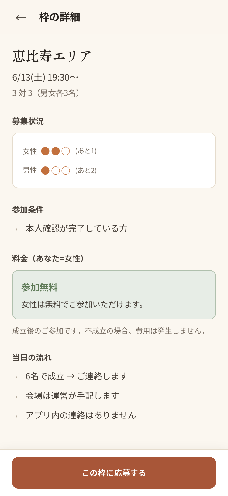 |

| U-05 応募不可（条件不足） | U-06 応募確認 | U-07 マイ応募状況 |
|---|---|---|
| 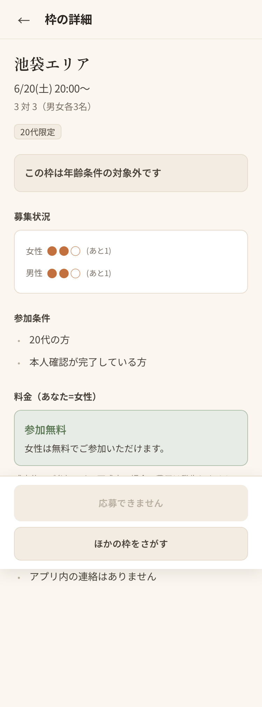 | 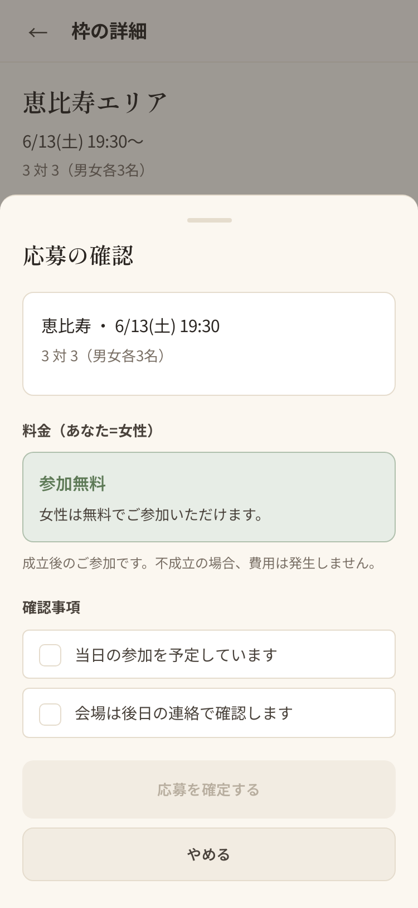 | 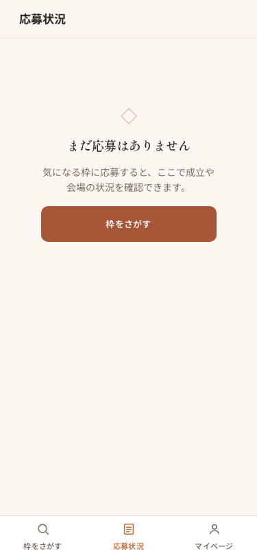 |

### STEP 5-9｜決済 → 成立詳細 → 評価 → バッジ
| U-10 マイページ（優良バッジ表示） |
|---|
| 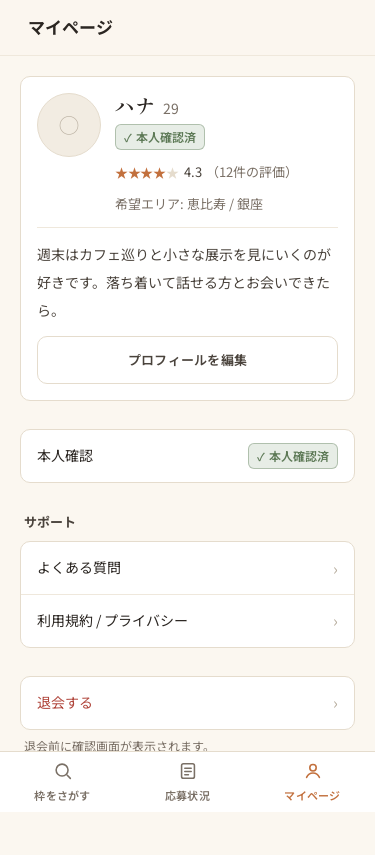 |

> **U-14 決済 / U-08 成立詳細 / U-15 相互評価** の実画面スクショは未取得（ブラウザ自動撮影が本環境(WSL)で不安定なため）。
> レイアウトは [wireframes.md](design/wireframes.md)（U-14/U-08/U-15）、規約は [design-system.md](design/design-system.md) §4.7C(決済UI)・§4.7D(星評価) を参照。実装は完了済み（tsc/test/build green）。

### 運営admin（PC）
| A-02 枠作成（参加条件設定） |
|---|
| 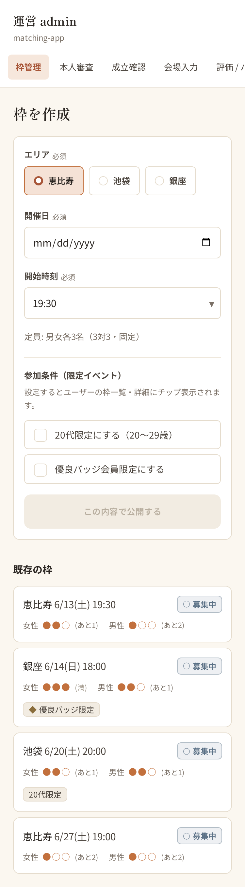 |

> **A-04 成立確認 / A-05 会場入力＆通知 / A-10 バッジ付与状況** の実画面スクショは未取得。レイアウトは [wireframes.md](design/wireframes.md)（A-04/A-05/A-10）を参照。実装は完了済み。

---

## 3.5 S8 追加画面（実装済み）

> 下表の画面はすべて**実装・ビルド検証済み**（tsc rc0／単体テスト313 passed／本番ビルド green）。実画面スクショは下の「S8 画面ギャラリー」に掲載（本番ビルドをPORT3700で起動し撮影。`U-15′ 多軸評価`のみ、seedに開催完了済みイベントが無いため実データ撮影は保留＝コードと§3.5表で確認）。

| 画面 | ルート | 役割 | 確認観点 |
|------|--------|------|----------|
| **P-04 公開 枠一覧** | `/explore`（認証不要） | 未登録でも開催予定の会を一覧。各カードに条件・充足・男性料金。固定フッタに「登録して参加」CTA | 未ログインで表示できる／予約不可で登録誘導 |
| **P-05 公開 枠詳細** | `/explore/[id]`（認証不要） | 参加予定メンバーを**匿名サマリ**で表示（職種・年代・★多軸評価・優良バッジ）。氏名/写真/LINEは非表示 | PIIが出ていない／「登録して参加」へ |
| **C-00 リリース待ち** | `/coming-soon` | 「リリースをお待ちください」。`RELEASE_MODE=waiting` 時の本編入口の差し替え先 | 文言・編集的トーン／公開プレビューと運営は対象外 |
| **U-15′ 多軸 相互評価** | `/ratings/[slotId]` | 同席者ごとに**また会いたい／会話／マナー**を★1-5＋任意コメント＋「来なかった」報告 | 3軸の星入力／no-show報告チェック |
| **A-06 会場候補** | `/admin/venues` | 成立枠ごとに合コン向きの店候補（食べログ／Google点・fitScoreでソート）。choose（予約名入力）/ reject / 候補生成 | 候補のソート／choose・rejectの動作 |

### S8 画面ギャラリー（実画面・スマホ縦 / adminはPC）

| P-04 公開 枠一覧（未認証で閲覧） | P-05 公開 枠詳細（匿名サマリ＝氏名/写真なし） |
|---|---|
| 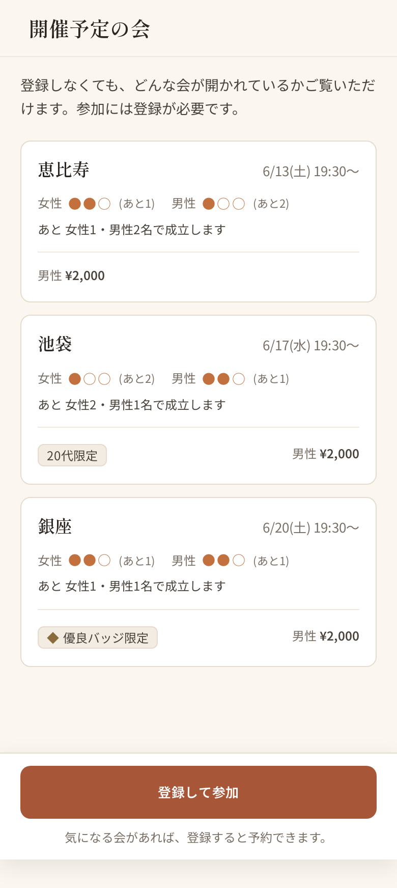 | 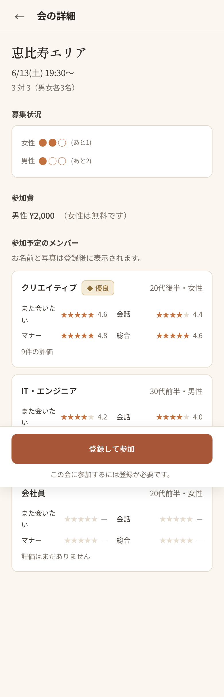 |

| C-00 リリース待ち | A-06 会場候補（admin・食べログ/Google/合コン向き度） |
|---|---|
| 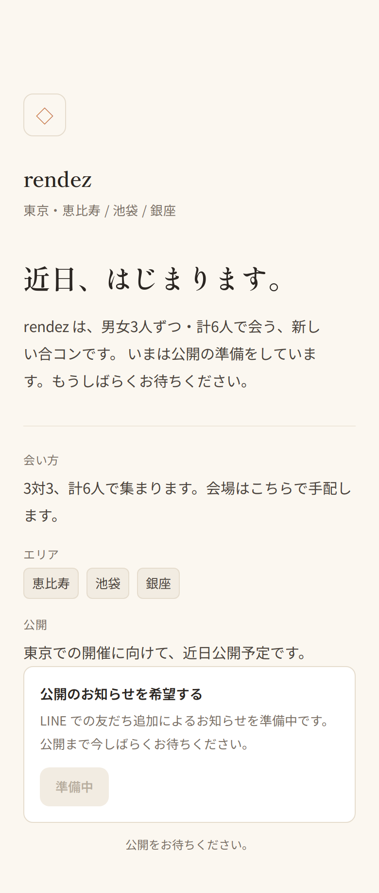 | 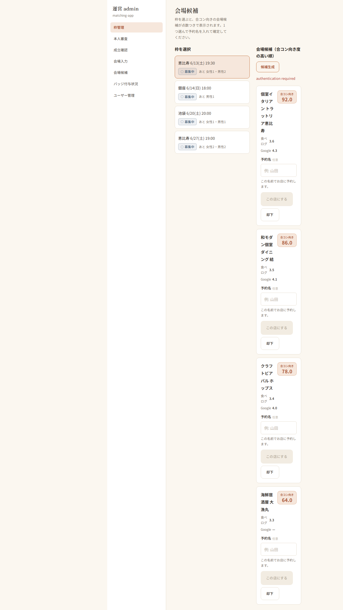 |

> **U-15′ 多軸 相互評価（また会いたい／会話／マナー＋「来なかった」報告）** の実画面は、seedに開催完了済みイベントが無く pending 評価が生成されないため未撮影。UIは実装・単体テスト済み（`src/app/ratings/[slotId]/page.tsx`／`src/components/ui/Stars.tsx`：StarInput×3＋MultiAxisSummary）。

実装ファイル（レビュー用）:
- P-04/P-05: `src/app/(public)/explore/page.tsx`・`src/app/(public)/explore/[id]/page.tsx`／`src/components/public/{PublicSlotCard,PublicMemberCard,RegisterCta}.tsx`／出口関門 `src/lib/serializers.ts`
- C-00: `src/app/coming-soon/page.tsx`・`src/components/{ComingSoon,ReleaseGate}.tsx`／`src/lib/release.ts`
- U-15′: `src/app/ratings/[slotId]/page.tsx`・`src/components/ui/Stars.tsx`（StarInput×3＋MultiAxisSummary）／`src/lib/domain/rating.ts`
- A-06: `src/app/admin/venues/page.tsx`・`src/components/VenueCandidateCard.tsx`／`src/lib/venue-service.ts`
- ドタキャン罰金: `src/lib/domain/noshow.ts`・`src/lib/noshow-service.ts`・`src/lib/payment-service.ts`（¥5,000・冪等）
- AI認証: `src/lib/haiku-verify.ts`（MOCK_AI決定的・18歳未満安全弁）

---

## 4. デザインの方向（“AIっぽさ”を排した編集的トーン）
- 生成りのオフホワイト地＋テラコッタ1アクセント、明朝見出し×ゴシック本文、細ボーダー主体。
- 避ける: 紫グラデ/ネオン/絵文字過多/量産SaaS構図/煽りコピー。
- 状態は色だけに頼らずラベル＋形状を併記（アクセシビリティ）。
- 詳細: [design/design-system.md](design/design-system.md)

---

## 5. FBの出し方
- 画面IDを添えて（例: 「U-05 の応募不可文言を変えたい」「A-05 に予約確認の再送ボタンが欲しい」）。
- 遷移・制限の変更（例: 本人認証を任意に／課金額変更／エリア追加／チャット追加）は [SPEC.md](SPEC.md) 末尾にまとめて。
